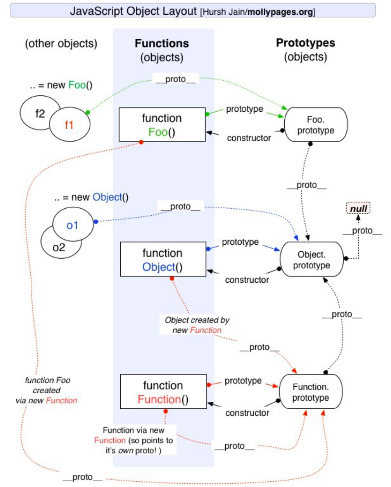
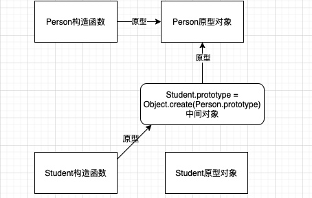

#### 1.new调用函数和普通函数有什么区别

1. 在内存中创建新的一个对象（空对象）；

2. 这个对象的\__proto__属性（对象的原型是隐式原型）会被赋值为该构造函数的prototype属性

   Bar.\__proto__ === Function.prototype

3. 构造函数内部的this，会指向创建出来的新对象；

4. 执行函数的内部代码（函数体代码）；

5. 如果构造函数没有返回非空对象，则返回创建出来的对象；

6. ```js
   //手写一个new
   function myNew() {
     const Constructor = Array.prototype.shift.call(arguments);
     const newObj = {};
     Object.setPrototypeOf(newObj, Constructor.prototype);
     const returnOfConstructor = Constructor.apply(newObj, arguments);
     return Object.prototype.toString.call(returnOfConstructor) ===
       "[object Object]"
       ? returnOfConstructor
       : newObj;
   }
   ```

7. 对象的\__proto__属性的意义：谁创建的我，也就是谁new的我，我就把它作为我的原型链的上流，作为查找对象

8. 函数的prototype意义：就是自己的原型对象，而函数最为一个对象来说的话，他的\__proto__属性是Function构造函数


 #### 2.构造函数的缺点

如下代码：如果我创建了多个对象，每个对象的都会有一个eating的函数（类似逻辑的函数），这是没有必要的。

```js
function Person(){
  this.eating=function (){
    console.log(this.name+"...")
  }
}
```

#### 3.引出原型和原型链概念

原型链:

> 从对象中获取某一个属性，**！！只针对于对象**，它会触发 [[get]] 操作，在当前对象中去查找对应的属性, 如果找到就直接使用，如果没有找到, 那么会沿着它的 \__proto__属性去原型对象上查找（这个原型对象是当前对象的构造函数的prototype的指向），一直找到Object的原型对象，这个如同链式查找，叫做原型链。
>
> 正是原型链查找的这个机制实现了类的继承，让js更像一门面向对象的语言

```js
var obj = {};
Object.prototype.address = "黑龙江";
console.log(obj.address); //黑龙江
console.log(obj.__proto__ === Object.prototype); //true
console.log(Object.prototype.__proto__); //null 
```

> Object的原型对象是没有原型，Object的原型对象是顶层，是所有类的父类
>
> Object的原型对象有很多默认的属性和方法


原型：

> 对象上是隐式原型属性，函数上是显式原型属性，他们都指向同一个对象（原型对象，拥有一个constructor属性（指向构造函数本身））



####  4 .创建对象方案：

1. 原型链继承

   ```js
   Student.prototype=new Person（）//让person的实例作为Student的原型对象
   ```

   第一个弊端:：打印子类对象, 继承的属性是看不到的

   第二个弊端：获取父类的引用, 修改引用中的值，会相互影响，相当于修改了父类的属性值

   第三个弊端：无法向构造函数传参数

2. 借用构造函数继承

   ```js
   Person.call(this, name, age, friends)
   ```

​		 第一个弊端：构造函数调用了两次

​		 第二个弊端：子类的原型的原型对象上会有一些多余的属性，（在new Person的时候造成的）

3. 原型式继承函数（dgls）

   ```js
   function create(obj) {
     const newobj = { };
     Reflect.setPrototypeOf(newobj, obj);
     return newobj;
   }
   //让传入的对象作为返回对象的原型
   ```

   创造一个新的对象以传入的对象为自己的原型，针对于对象之间的继承

   第一个弊端：局限于对象，失去了继承构造函数继承的意义

4. 寄生式继承函数

   创建一个仅用于封装继承过程的函数，该函数在内部以某种形式来做增强对象，最后返回对象，结合原型式继承和工厂函数实现，也是局限于对象。

5. 寄生组合式继承

   ```js
   Student.prototype = Object.create(Person.prototype)
   ```

   

   以父类的原型为目标，创造一个以父类原型为原型的对象，（这个新的对象隐式原型和Person构造函数的显示原型都是同一个指向），在以这个对象为子类的原型

   这种方式的高效率体现它只调用了一次 Parent 构造函数，并且因此避免了在 Parent.prototype 上面创建不必要的、多余的属性。与此同时，原型链还能保持不变；因此，还能够正常使用 instanceof 和 isPrototypeOf。开发人员普遍认为寄生组合式继承是引用类型最理想的继承范式。

#### 5.对类的理解大彻大悟

ES6的CLASS extends关键字是使用了寄生式组合式继承和使用父类构造函数来实现类的继承

继承核心代码：

```js
function inheritAttrsPrototype(SubType, SuperType) {
  SubType.prototype = Object.create(SuperType.prototype);
  Object.defineProperty(SubType.prototype, "constructor", {
    value: SubType,
    enumerable: false,
    writable: true,
    configurable: true,
  });
}
```

子类的构造方法的\__proto__指向了父类，实现了静态方法的继承，请看如下代码和解释

```js
_setPrototypeOf(subClass, superClass);
//和下面做法如出一辙
function Person() {}
function Student() {}
Object.setPrototypeOf(Student, Person);
```

（这一步操作相当于把子类的构造函数看作一个对象，让该对象的原型指针（\__proto__）不指向Object，而指向父类，所以说在父类上定义的静态方法，是加到它本身的，所以可以让子类继承）

#### 6.super

JS引擎再解析子类的时候有要求，如果我么实现了继承，那么在子类的构造方法中，必须使用super，并且在this使用之前。

```js
class Person {constructor() {}}
class Student extends Person {}
```

为什么呢？

super代替的是父类的构造函数，super（name）相当于调用了Person.prototype.construct or. call(this,name),借用了父类的构造函数实例化了子类实例，就是如此规定的，所以不调用super的话，子类就不能实例化，得不到自己的this，所以先于super使用this，就会报错。

源码中的操作：
通过Super创建出来一个实例，但是这个实例的constructor指向的是子类（NewTarget）

```javascript
Reflect.construct(Super,argument,NewTarget)
```

与下面方法等效：

```js
var obj2 = Object.create(OtherClass.prototype);
OneClass.apply(obj2, args);
```

