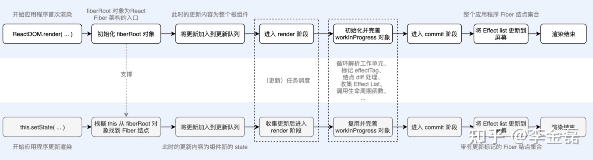

# react的渲染流程：

对与首次渲染，react将react.render接受到的vnode转化为fiber树，并根据fiber树的层级结构，构建出dom树渲染到屏幕中。

对于更新渲染的时候，fiber树已经存在于内存之中，主要工作就是算出差异，并将变化映射到屏幕上去。

#### 大体流程梳理：

##### 不论是首屏渲染还是更新渲染，这些渲染任务都会经过scheduler的调度（排列优先级）

> 比如用户触发的更新优先级非常高，如果当前正在进行一个比较耗时的任务，则这个任务就会被用户触发的更新打断，在Scheduler中初始化任务的时候会计算一个过期时间，不同类型的任务过期时间不同，优先级越高的任务，过期时间越短，优先级越低的任务，过期时间越长。在最新的Lane模型中，则可以更加细粒度的根据二进制1的位置，来决定任务的优先级，通过二进制的融合和相交，判断任务的优先级是否足够在此次render的渲染

scheduler调度器会给渲染任务一个事件片（默认5ms），如果没有执行完的话，就会让当前渲染到fiber节点暂停任务，让出控制权交给浏览器，在之后浏览器空闲的时候，从之前暂停的那个fiber节点，继续后面的任务，然而我现在说的这个任务就是计算fiber的差异，并且标记副作用的tag，

在render阶段：render阶段的主角是Reconciler，在mount阶段和update阶段，它会比较jsx和当前Fiber节点的差异（diff算法指的就是这个比较的过程），将带有副作用的Fiber节点标记出来，这些副作用有Placement（插入）、Update（更新）、Deletetion（删除）等，而这些带有副作用Fiber节点会加入一条EffectList中，在commit阶段就会遍历这条EffectList，处理相应的副作用，并且应用到真实节点上。而Scheduler和Reconciler都是在内存中工作的，所以他们不影响最后的呈现。

在commit阶段：会遍历EffectList，处理相应的生命周期，将这些副作用应用到真实节点，这个过程会对应不同的渲染器，在浏览器的环境中就是react-dom，在canvas或者svg中就是reac-art等。
