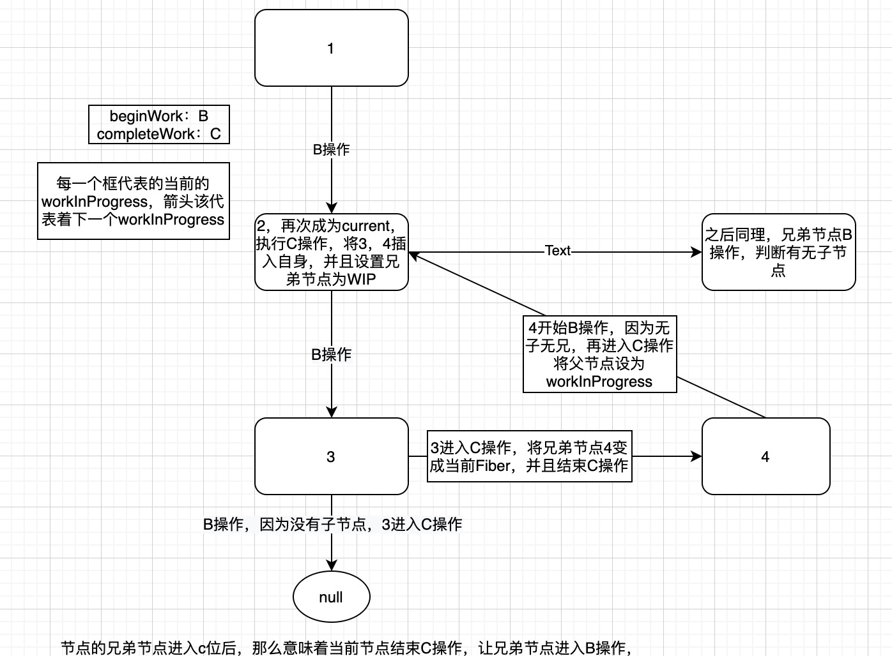

## react从始至终管理着三个东西：

最开始react没有上一次的状态，也就是没有current（因为是首屏渲染），所以说react新创建了一个ininitalFiber（未初始化的Fiber），所有的节点都是null（这个是假装成上次状态的一个fiber，就是个占位的类似东西）

平时所说的render，都是把改vnode转化为真实dom，然后挂载到某个根节点上，或者说diff然后真实渲染到页面上**而react中的render不是一样的，react指的是创建fiber的过程。**

### render阶段：

1. 位每个节点`创建或者是复用新fiber（workInProgress）`生成一颗有新状态（新的数据）的`workInProgress`
2. 初次渲染的时候，或者新创建了某个节点的时候，会根据`fiber`创建真实的dom实例，并不会插入到页面，而是将它的子节点插入到自己的身上。（不断的完善自己的dom树，但是不插入到页面）
3. 更新阶段的时候，对比新旧fiber的状态，将产生更新的fiber节点，最终通过链表的形式挂载到rootFiber上

### commit阶段：

真正操作页面的阶段。1. 执行生命周期，2. 会从rootFiber上获得链表，根据这条链表的标识，更新页面

## workLoop循环（创建fiber）

```js
  //workLoopConcurrent函数 开启concurrent异步模式，每次进入工作循环的时候需要判断浏览器是否有空余时间
  while (workInProgress !== null && !shouldYield()) {
  var current = workInProgress.alternate;
  //复用fiber
    
  var next = beginWork$1(current, workInProgress, subtreeRenderLanes);
  //不断的创建下一个fiber的工作循环
    
  next === null ？completeUnitOfWork(workInProgress) ：workInProgress = next;
  //创建fiber，如果当前的fiber是空，意为父节点的第一个子节点为空，那么就要找他的subling节点（兄弟），进入completeWork函数
  } 
```

### beginWork和completeWork

这两个循环while循环，用下面的图来简单说明，如下介绍的是首屏渲染环节

`beginWork`循环: 先遍历所有节点的第一个子节点，为深度优先遍历也就是`fiber`的单侧树

`completeUnitOfWork`循环：当接收到当前`fiber`节点的`first child`为空的条件，会对当前的fiber节点`（completeWork操作）`

这两者循环，将`workInProgress`扔进去，返回我们想要的结果



> ```js
> function completeUnitOfWork(unitOfWork) {
> var completedWork = unitOfWork;
> do {
> var returnFiber = completedWork.return; //父亲节点
> var siblingFiber = completedWork.sibling; //兄弟节点
> 	//completeWork操作，真实dom创建等等
> if (siblingFiber !== null) {
> workInProgress = siblingFiber;     return;
> //当兄弟节点不为空，当前fiber的兄弟赋给 workInProgress，并且return，即结束completeWork，兄弟节点会就会进入beginWork任务。
> }
> workInProgress = returnFiber; //如果兄弟节点为空的话，父亲节点在赋给workInProgress，又进入了completeUnitWork函数
> } while (completedWork !== null); // We've reached the root.
> }
> 		最底层的节点是没有子节点的，如果有兄弟节点会执行`workInProgress = siblingFiber`操作，并且直接return，在对这个兄弟节点进行beginWork，发现没有子节点，就会又进入completeUnitOfWork循环，为这个兄弟节点 completeWork 操作。 （没有兄弟节点的不会有这一操作）
>  因为它是有父节点的所以会执行操作`workInProgress = returnFiber` ，父节点作为workInProgress再次进入 completeUnitOfWork 循环，对父节点执行`（completeWork操作）`，这样子节点就全部插入到父节点的身上了。
>  父节点继续下面的逻辑，如此循环
>  只要当前的workInProgress树转移到了兄弟节点，那么意味着当前节点结束beginWork探索，进入completeWork回溯，让兄弟节点进入beginWork探索
> ```
>
> `completeWork`操作：创建真实dom实例，将自己的子节点进行插入，把props的键值赋给真实dom
>
> 对所有的fiber节点的遍历，规则都是如此，`first child -> sibling -> return `

##### 总结：对于一棵子树的创建，会深入到他的下面的层级，直到到first children的尽头，之后在转移到它的兄弟节点，在进行如此创建子树。当一棵树的所有子节点都创建完毕了（也就是真实的dom节点都插入了当前树上），直到root，fiber树就构建完成了。

#### 自我理解：

#### beginWork相当于顺序地不断的探索每颗树的深度，并且创建fiber，将他们链接；

> 首屏渲染：直接构建fiber树，没有复用alternate等过程

#### completeWork自下而上的拼接每个子树（不断的完善dom结构，一层一层的插入到当前的父节点上，而不插入页面）；

至创建fiber

解开疑问：fiber上保存着ReactElement，所以说在遍历fiber的时候，通过reactElement来获取子节点（数组中第一个元素），然后通过这一属性，来生成子节点，同时还要为每个节点连接起来，在组件上保存的fiber实例永远都是第一次的fiber`

不管是初次渲染还是setState，每次更新都是从root开始往下遍历的。


> 产生更新 调度，优先级
>
> 决定需要更新什么组件 协调 diff
>
> 将更新的组件渲染到页面  渲染 commit
>
> 
>
> react16之后：不再是reconciler（协调器）和渲染器交替工作了，而是只有所有的组件都完成了reconciler工作，才会统一交给renderer 。也就是说明reconciler只是将变化的虚拟dom打上了增删改的标签。
>
> 
>
> reconciler工作的阶段被称为render阶段，改阶段回调用组件的render方法
>
> Renderer工作阶段被称为commit阶段，会把render提交的信息，渲染到页面上
>
> vnode 转化为fiber的时候，就做了工作

### 面试题：setState()是同步还是异步的?

正常情况下，也就是没有使用concurrent组件是同步更新的，但是不会立即获取到最新state的值。因为调用setState，只是将你传进来的新的state放入updateQueue这条链表上，等这个点击事件结束后，合成事件内部不会立即执行，会触发内部的一个回调函数，在回调函数中更新state以及重新渲染

1. 开启concurrent模式，才真正的开启异步方式（postMessage，放入eventLoop中），同样获取不到最新的state状态，是组件更新操作放入事件循环中。
2. 使用了flushSync（）这个api，react更新是完全同步的，改一个，渲染一个，可以获得到最新的state
3. 使用setTimeOut，原生的绑定事件，也是同步更新的。可以获得到最新的state，不是在合成事件中的话，就可以获得
4. react中的合成事件，就是为了触发事件的回调函数放入事件循环中


> 执行一次setState，获取fiber，创建一个更新，将这个更新存到了这个fiber（第一次的fiber）的updataQueue上，
>
> 但是现在的workInProgress fiber上没有更新队列，所以将第一次fiber的updataQueue指向到了workInProgress上。
>
> updateQueue这条链表在两颗树上，来回的传递

说是2棵树，但是在我认为是三棵树。

因为使用了fiber双缓存树，新创建的workInProgress Fiber上是没有updateQueue，所以说，要同步updateQueue

 

