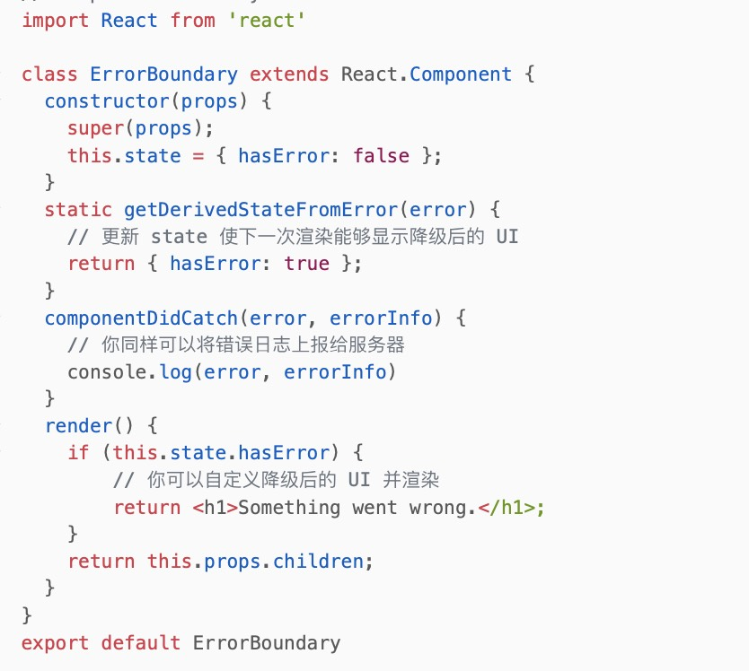

# 生命周期如果组件的躯干

## 老的生命周期

 

1. 组件初始化阶段 initialization, 比如constructor

2. 组件挂载阶段 mount

   >   componentWillMount  组件挂载到DOM前调用,只会被调用一次, 这里写setState不会引起组件重新渲染
   >   render 返回一个react元素, react根据此函数的返回值渲染DOM. 不能在这里setState
   >   componentDidMount 组件挂载到DOM后调用, 且只会被调用一次

3. 组件的更新阶段 update

   >   `componentWillReceiveProps(nextProps) `触发于props引起的组件更新过程中，已经使用getSnapshot...生命周期替代。
   >   ` shouldComponentUpdate(nextProps, nextState)` 比较之前和当前的props state是否有变化，SCU优化
   >
   >   `componentWillUpdate(nextProps, nextState)` render方法前执行
   >   ` render`获取最新的state和props，渲染视图
   >   `componentDidUpdate(preProps, preState)`

4. 组件的卸载阶段 unmount

   > componentWillUnmount 卸载前调用, 在这里可以清理一些定时器

5. `componentDidCatch（error，info） static getDerivedStateFromError`

   一般我们封装一个ErrorBoundary组件，将可能出错的组件包裹起来，当子组件挂了(异步组件)，抛出错误信息，ErrorBound组件通过这两个生命周期捕获error，展示降级UI，同时也可上报给服务器

   

捕获报错信息，展示降级UI，发送报错信息，错误上报

#### 废弃的生命周期

> `componentWillMount、componentWillReceiveProps、componentWillUpdate`
> 本身这三个生命周期所表达的含义是没有问题的，我们可能会在这三个函数中编写了有副作用的代码，提出一种可被打断的生命周期，而可以被打断的阶段正是实际 dom 挂载之前的虚拟 dom 构建阶段，
>
> 所以要替换掉这三个生命周期，因为这三个生命周期可能在一次 render 中被反复调用多次。源于fiber，因为开启异步渲染，在render之前的生命周期函数可能会被执行多次，所以去掉了一部分生命周期<a href="https://juejin.cn/post/6914112105964634119#heading-4">详细信息</a>

## 新的生命周期

##### 取而代之的是另外的两个生命周期

> `getDerivedStateFromProps(nextProps,nextState)`
>
> **这个生命周期主要为我们提供了一个可以在组件实例化或 props、state 发生变化后根据 props 修改 state 的一个时机**，用来替代旧钩子 WillMount、WillReceiveProps。是一个静态方法，this 指向不是组件实例。所以说我们在异步请求数据保存数据的时候的时候，还需要使用componentDidUpdate函数来处理。
>
> 在了解了钩子作用后，可以很明确的说，这个钩子确实没啥大作用，官网也说了，除非你有`props`永远都作为子组件`state`的场景，不然一般你也用不上它，即便有这个场景，我们不用这个钩子一样能实现，所以这个钩子基本没啥存在感。
>
> **getDerivedStateFromProps 和 componentWillReceiveProps 只会在 props “改变”时才会调用。实际上只要父级重新渲染时，这两个[生命周期](https://so.csdn.net/so/search?q=生命周期&spm=1001.2101.3001.7020)函数就会重新调用，不管 props 有没有“变化”。**getDerivedStateFromProps 容易编写反模式代码，使受控组件和非受控组件区分模糊
>
> ##### 导致子组件setState组件不刷新问题（面试题）：
>
> 1，直接复制 props 到 state 上（state单独一个变量存储props，不直接复制到state），因为setState已经更新了，但是由于在钩子的判断中判断错误，导致state值又被设置了回去
>
> 2，如果 props 和 state 不一致就更新 state

> `getSnapshotBeforeUpdate（prevProps,prevState）`
>
> getSnapshotBeforeUpdate 方法是配合 React 新的异步渲染的机制，在DOM更新发生前被调用，在这个阶段我们可以拿到上一个状态 Dom 元素的坐标、大小的等相关信息。做一个数据处理，其返回值将作为 componentDidUpate 的第三个参数，在这个钩子里处理如何如何。可看官方实例
>
> 用于替代旧的生命周期中的 componentWillUpdate。

## 对于生命周期之中的一些说明

#### 1.数据请求：

1. 请求数据应该在componentDidMount阶段进行，不论数据依不依赖dom节点，这个时候都是绝对安全的，有些人还习惯在constructor或者componentWillMount中，进行数据请求，认为这样可以更快的获取到数据，但提前的时间实在是太微乎其微了。

   > 另外服务器渲染时，componentWillMount是会被调用两次的，一次服务器端，一次客户端，导致额外的请求发生。

2. 组件进行数据请求的另一种场景：父组件的更新导致组件的props发生变化，子组件的数据请求依赖props，需要重新请求数据，刷新视图。例如，**（奇安信实习，工单详情需求）**新闻详情组件NewsDetail，在获取新闻详情数据时，需要传递新闻的id作为参数给服务器端，当NewsDetail已经处于挂载状态时，如果点击其他新闻，我们写在子组件中的生命周期componentDidMount并不会重新调用，数据请求不会再次执行。**应该在componentWillReceiveProps中(这个生命周期只会组件只会一次render)，进行数据请求：自己分析之后应该在component DidUpdate（两次render）中操作**

   > 无论怎么做，处理的方法都不够优雅，那么新推出的hook，就解决了这一点，useEffect

#### 2.setState的时机

componentWillMount、componentDidMount、componentWillReceiveProps、componentDidUpdate

##### 这里有几个注意点

1. 1. componentWillMount 中**同步**调用setState不会导致组件进行额外的渲染。如果是**异步**调用setState，组件是会进行额外的更新操作。
   2. 一般情况下，当调用setState后，组件会执行一次更新过程，componentWillReceiveProps等更新阶段的方法会再次被调用，但如果在componentWillReceiveProps中调用setState，并不会额外导致一次新的更新过程，（注意，这里仍然指**同步**调用setState，如果是异步调用，则会导致组件再次进行渲染）
   3. componentDidUpdate在setState前必须有条件判断，只有满足了相应条件，才setState，否组组件会不断执行更新过程，进入死循环。因为setState会导致新一次的组件更新，组件更新完成后，componentDidUpdate被调用，又继续setState，死循环就产生了。

##### 不可以的方法

1. 1. 产生死循环。例如，shouldComponentUpdate、componentWillUpdate 和 render 中调用setState，组件本次的更新还没有执行完成，又会进入新一轮的更新，导致不断循环更新，进入死循环。
   2. 无意义。componentWillUnmount 调用时，组件即将被卸载，setState是为了更新组件，在一个即将卸载的组件上更新state显然是无意义的。

#### 3. render次数！==浏览器更新次数

在componentDidMount中setState是否会触发两次浏览器渲染？

不会，两次setState在一个js时间循环里，只会渲染一次