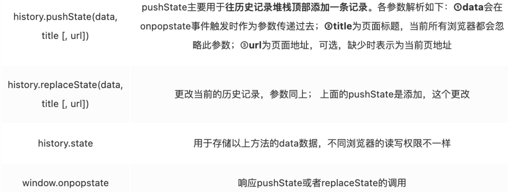

# 前端路由的诞生

SPA的诞生，带来了前端路由，SPA 就是一个WEB项目只有一个 HTML 页面，一旦页面加载完成，SPA 不会因为用户的操作而进行页面的重新加载或跳转。 取而代之的是利用 JS 动态的变换 HTML 的内容，从而来模拟多个视图间跳转。

前端路由为了解决我们仅在有一个index.html的情况下，记录用户的浏览历史记录，用户的前进或者后退都对应着页面，就算刷新页面，内容页面也不会消失，当前的URL可以辨认出页面的所在位置

前端开发完全组件化，页面的切换即为组件的切换：不发起http请求，直接通过url映射到对应的组件进行渲染。

# 两种模式

## 1. hash路由

该模式下，是纯前端静态路由，利用了锚点技术，hash部分切换，不会向服务器发出请求，不会引起页面重新加载的机制实现的一种模式，可以理解为hash模式在前端自生自灭。

> 原理：`hash`值切换的时候，会触发浏览器的**`hashchange`事件**，路径切换时，我们匹配相关的路由页面（无非就是组件的卸载，挂载函数的执行）
>
> 浏览器的前进后退也能对其进行控制，在 H5 的 history 模式出现之前，基本都是使用 hash 模式来实现前端路由

`所属location属性 `: <a href="https://developer.mozilla.org/zh-CN/docs/Web/API/Location">MND参考文档</a>

#### 手写hash：(无非就是监听hash的改变，随它而动)

> ```js
> 		<a href="#01">hash路由01</a>
>     <a href="#02">hash路由02</a>
>     <a href="#03">hash路由03</a>
>     class HashRouter {
>         constructor() {
>             this.map = {//路由的url和组件的映射关系
>                 "01": () => console.log("01页面挂载渲染"),
>                 "02": () => console.log("02页面挂载渲染"),
>                 "03": () => console.log("03页面挂载渲染")
>             }
>             const hashchange = () => {
>                 const path = location.hash.slice(1) || "/"
>                 this.go(path)
>             }
>             window.addEventListener("hashchange", hashchange, false)
>             window.addEventListener("load", hashchange, false)
>         }
>         go(path) {
>             this.map[path]?.()
>         }
>     }
>     const parent = document.querySelector(".parent")
>     const router = new HashRouter()
> ```

## 2. history路由

history API 是 H5 提供的新特性，提供了对浏览器的会话历史的访问，允许你在用户浏览历史中向前和向后跳转，直接更改前端路由（`主要是pushState这个api`）**，即更新浏览器 URL 地址而**不重新发起请求。

#### 关键API

> `history`的感知`onpopstate`事件：
>
> 不会因`pushState`或者`replaceState`的调用而响应，他是为`浏览器前进、后退、history.go()、history.back()、history.forword()`服务的，我们需要自定义事件来触发事件，浏览器历史记录发生改变，`onpopstate`便会触发。（我理解的popstate是为了前进或者回退的时候渲染相应组件）
>
> 使用`location.pathname`或者存入`state`之中获得url，都是可行方案

#### 手写history（禁止a标签的默认事件，获得heaf，渲染相应函数）

```js
        <a href="/01">history路由01</a>
        <a href="/02">history路由02</a>
        <a href="/03">history路由03</a>
    const parent = document.querySelector(".parent")
    class HistoryRouter {
        constructor() {
            this.map = {
                "01": () => console.log("01页面挂载渲染"),
                "02": () => console.log("02页面挂载渲染"),
                "03": () => console.log("03页面挂载渲染")
            }
            parent.addEventListener("click", (e) => {
                if (e.target.tagName.toLowerCase() !== "a") return
                e.preventDefault()
                let path = e.target.getAttribute("href").slice(1)
                history.pushState({ path }, null, path)
                this.map[path]?.()
            })
            window.addEventListener("popstate", (e) => {
                const path = e.state?.path || "/"
                if (!(path in this.map)) {
                    console.log("页面不存在");
                    return;
                }
                this.go(path)
            })
        }
        go(path) {
            this.map[path]?.()
        }
    }
    const router = new HistoryRouter()
```

# 两者的对比

## 1. 存在的问题

#### 刷新问题

hash 改变了 url ，不会包括在 http 请求中。算是被用来指导浏览器的动作，并不影响服务器端。 nginx 也就不会拦截。history 时，在对当前的页面进行刷新时，此时浏览器会重新发起请求。如果 nginx 没有匹配得到当前的 url ，就会出现 404 的页面。所以需要**通过服务端重定向**。

> 虽然spa框架都会默认的重定向机制，但是最多改善就是重定向到index.html页面，这并不完美，如果需要完美重定向，需要nginx或者别的静态服务器对项目中所有的路由配置重定向，这工作量很大也不优雅。所以低成本还是hash模式。

```js
///单个服务器的后端的nginx配置如下：
location / {
  try_files $uri $uri/xxx/index.html;
}
//存在代理的情况下：
locaiton /{
  rewirte ^ /file/index.html break;//代表cdn的资源
  proxy_pass https://www.xxx.cnd.com
}
```

#### 缓存

使用浏览器的前进，后退键的时候会重新发送请求，没有合理地利用缓存

## 2.  How select ?

- to B 的系统推荐用 hash，相对简单且容易使用，且因为 hash 对 url 规范不敏感；
- to C 的系统，可以考虑选择 H5 history ，但是需**要服务端支持**；
- 能先用简单的，就别用复杂的，**要考虑成本和收益**。

