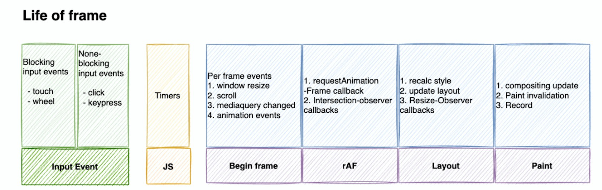

### requestAnimationFrame - 不是宏任务

> `window.requestAnimationFrame() `告诉浏览器——你希望执行一个动画，并且要求浏览器在下次重绘之前调用指定的回调函数更新动画。该方法需要传入一个回调函数作为参数，该回调函数会在浏览器下一次重绘之前执行 --- MDN

- 执行时机和宏任务完全不一致。
- raf任务队列被执行的时候，会将其此刻队列中所有的任务都执行完。
- 传入的回调函数执行时机：**raf函数会在一次eventLoop的微任务之后执行，本次的渲染之前执行，是当前帧绘制之前执行，回调函数中拿到的`rafTime`代表的意思当前帧布局绘制之前的执行时刻（准确的来说并不是当前帧的收到垂直信号时刻）**

> 但是查阅了[相关规范](https://html.spec.whatwg.org/multipage/webappapis.html#event-loop-processing-model)之后，`一个eventLoop`的完整过程是包含这浏览器的渲染过程的，ref的执行会在一个eventLoop中的微任务结束后，下一个`eventloop`开始前去执行，准确的说就是本次一帧的渲染之前执行

- 传入的回调函数中的参数`rafTime`== `performance.now()`，可以理解为打开页面到执行回调函数的毫秒时间
- requestAnimationFrame 的回调会在每一帧确定执行，属于高优先级任务

#### requestAnimationFrame 比起 setTimeout、setInterval 的优势主要有两点：

- requestAnimationFrame 会把每一帧中的所有 DOM 操作集中起来，在一次重绘或回流中就完成，并且重绘或回流的时间间隔紧紧跟随浏览器的刷新频率，一般来说，这个频率为每秒 60 帧。
- 在隐藏或不可见的元素中，requestAnimationFrame 将不会进行重绘或回流，这当然就意味着更少的的 cpu，gpu 和内存使用量。

## 原理

requestAnimationFrame() 方法接受一个回调函数，同时随机生成一个唯一的 handle 值作为标识符。回调函数和 handle 值共同组成一个元组 <handle, callback>，然后将这个元组推入动画帧请求回调函数队列中。

当页面可见时，如果动画帧请求回调函数队列中有元组，那么浏览器就会清空队列并且执行这些回调函数。

另外，每一个元组有一个 canceled 标识符，如果为 false，那么这个回调函数就不会在清空队列后被执行。cancleAnimationFrame() 方法的原理就是将这个标识符设置为 false。

### requestIdleCallback函数

执行时机：有空闲时间才执行，属于低优先级任务。

缺陷：

浏览器兼容不好的问题

 FPS 20，50ms 刷新一次，远远低于页面流畅度的要求

### MessageChannel -宏任务

属于 DOM event事件，优先级高于setTimeOut等计时器，所有先于他们执行

如果一个管道一样，是多个worker通信的方式

react中使用messageChannel和raf 模拟了ric

### 理解react中的ric函数的polyfill

请见react中的相关文档

