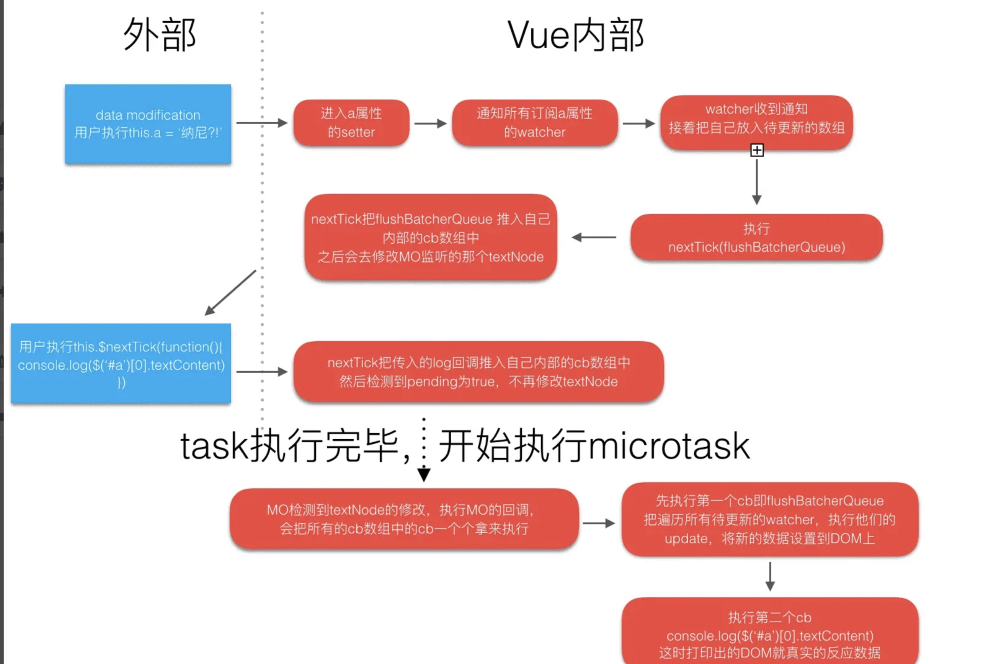

### 1. 浏览器的GPU线程和web前端密切相关，包括如下线程：

- **GPU渲染线程**
- **JS引擎线程**
- **事件触发线程**（和EventLoop密切相关）
- **定时触发器线程**
- **异步HTTP请求线程**

> **GPU渲染线程**和**JS引擎线程**是互斥的，为了防止DOM渲染的不一致性，其中一个线程执行时另一个线程会被挂起。

### 2. 任务队列分为`macro-task`（宏任务）与`micro-task`（微任务），在最新标准中，它们被分别称为`task`与`jobs`

| 任务类型 | 事件类型                                                     |
| :------- | ------------------------------------------------------------ |
| 宏任务   | `setTimeOut` 、 `setInterval` 、 `setImmediate` 、 `I/O` 、 各种`callback`、 `UI渲染` 、`messageChannel`等 |
| 微任务   | `process.nextTick` 、`Promise` 、`MutationObserver` 、`async(实质上也是promise)` |

> 这里重点说明一下，宏任务并非全是异步任务，主代码块属于宏任务的一种（promiseA+规范）

### 3. 执行机制

macro-task -->  所产生的micro-task （一轮结束）--> macro-task -->micro-task （补充：macro作为主导，他有支配micro的能力，也就是说在macro消灭了之后，他所产生的micro必须全部执行完，然后才能进入下一个macro任务，一次event Loop只取一个macro）

事件循环从宏任务队列开始，这个时候，宏任务队列中，只有一个`script(整体代码)`任务，执行script（整体代码）宏任务，其中如果产生微任务，将其推入微任务队列，在宏任务执行完之后，所产生的微任务立即执行（微任务执行时机是在宏任务执行之后，UI渲染之前执行）执行顺序如下：

> 1. 执行一个**宏任务**（首次执行的主代码块或者**任务队列**中的回调函数）
>
> 2. 执行过程中如果遇到**微任务**，就将它添加到**微任务**的任务队列中
>
> 3. **宏任务**执行完毕后，立即执行当前**微任务**队列中的所有任务（依次执行）
>
> 4. **JS引擎线程**挂起，**GPU线程**执行渲染
>
> 5. **GPU线程**渲染完毕后挂起，**JS引擎线程**执行**任务队列**中的下一个**宏任务**

浏览器为了能让JS线程和GUI线程有序切换，会在宏任务结束之后，下一个宏任务执行之前，对页面进行重新渲染（宏任务->渲染->宏任务.......）

**微任务**是在当前**宏任务**执行结束之后立即执行的任务（在当前 **宏任务**执行之后，UI渲染之前执行的任务）。**微任务**的响应速度相比`setTimeout`（下一个**宏任务**）会更快，因为无需等待UI渲染。

至于为什么nextTick在微任务中可以拿到更新后的dom，并进行一些操作。是因为我们写的nextTick回调函数放在了微任务最后，（见详解）响应式依赖的副作用函数都在它之前执行完毕，就可以拿到新内存中的dom了，UI渲染只是浏览器的一个动作，在之后执行。

##### 一般什么时候用到nextTick呢？

在数据发生变化后要执行某个操作，而这个操作依赖因你数据改变而改变的dom，那么这个操作就应该放在nextTick中。

### 4.自我理解的nextTick

如果Vue使用`setTimeout`等**宏任务**函数，那么势必要等待UI渲染完成后的下一个**宏任务**执行，而如果Vue使用**微任务**函数，无需等待UI渲染完成才进行`nextTick`的回调函数操作，可以想象在**JS引擎线程**和**GUI渲染线程**之间来回切换，以及等待**GUI渲染线程**的过程中，浏览器势必要消耗性能

> **函数解释说明：**

1. timerFunc函数：判断promise的then微任务，其次使用MutationObserve，再次setImmediate函数，最后setTimeout（降级处理）的优先级。无可

2. flushCallbacks函数：是刷新（全部重新执行一遍）callbacks数组（nextTick的全局数组）的函数，并且清空callbacks数组。

3. flushBatcherQueue（flushSchedulerQueue）函数：排序watcher队列，父组件的watcher先于子组件执行，避免子组件的二次刷新的性能问题，刷新（全部重新执行一遍）watcher数组。
4. 这些函数都有闭包的应用，queue：watcher函数回调数组。
5. callbacks：刷新watcher函数，自己写的nextTick回调函数。
6. pending：boolean值，控制当前只有一个flushCallbacks函数。

> **大致流程如下：**

1. 当响应式数据更新后，会调用 dep.notify 方法，通知 dep 中收集的 watcher 去执行 update 方法，update又调用queueWatcher方法，将watcher push到一个queue队列。
2. queueWatcher中又调用了nextTick函数，flushSchedulerQueue（刷新watcher的函数）作为参数传入。
3. nextTick函数的调用，将参数push进入callbacks数组，也执行了timerFunc函数。
4. 调用timerFunc函数，优先级选择flushCallbacks函数采用何种异步方式，之后flushCallbacks进入浏览器的异步队列（多为微任务），等待script（整体代码）执行完毕，进入执行栈执行。只是将刷新callbacks的函数推入异步任务，即完成了vue的异步更新策略

> 这也就是nextTick函数命名的原因，在下一次的事件循环回调，实际上是本次事件循环的最后执行的

### 5.Vue中nextTick函数的实现

- 将传递的回调函数用 try catch     包裹然后放入 callbacks 数组
- **执行 timerFunc函数，在浏览器的异步任务队列放入一个刷新 callbacks 数组的函数**

### Node.js的libve

1. timers
2. I/O callbacks
3. idle, prepare
4. poll
5. check（setImmedaite）
6. close callbacks

`process.nextTick()` 的函数会在事件循环的当前迭代中（当前操作结束之后）被执行。 这意味着它会始终在 `setTimeout` 和 `setImmediate` 之前执行。

延迟 0 毫秒的 `setTimeout()` 回调与 `setImmediate()` 非常相似。 执行顺序取决于各种因素，但是它们都会在事件循环的下一个迭代中运行。