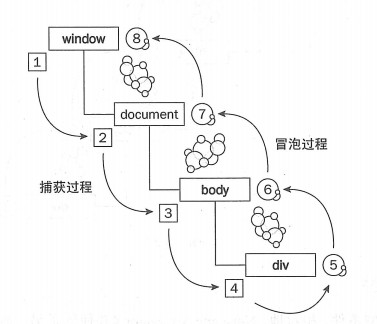

## 详解浏览器事件捕获，冒泡

**浏览器事件模型中的过程主要分为三个阶段：捕获阶段 -> 目标阶段 ->冒泡阶段**
经典:

window -> document -> body -> input -> body -> document ->

## addEventListener 第三个参数

**true：代表在捕获阶段执行**

**false：冒泡阶段进行**

**e.target:当前鼠标点击的元素**

e.currentTarget：绑定事件当前阶段的元素

我们平时写的都是在冒泡时的监听事件

## 阻止事件传播 

**e.stopPropagation()**

1. 大家经常听到的可能是阻止冒泡，实际上这个方法不只能阻止冒泡，还能阻止捕获阶段的传播。
2. 这个方法阻止事件的传播，如果的捕获阶段添加这个事件，后面一系列的事件都不会触发，在冒泡阶段的话，捕获阶段的事件还是可以正常执行的。
   > **场景设计题**：用户进入页面，会有一个状态 banned（boolean）,true：当前用户被封禁了，不可以触发任何事件，提醒用户“被封禁了”,false：正常访问页面
   >
   > 1. 在 window 的捕获阶段（第三个参数为true时），判断 banned，添加 e.stopPropagation()事件
   > 2. 写一个全屏的 最高层级的元素，遮罩住整个页面

**stopImmediatePropagation()**
如果有多个相同类型事件的事件监听函数绑定到同一个元素，当该类型的事件触发时，它们会按照被添加的顺序执行。如果其中某个监听函数执行了 event.stopImmediatePropagation() 方法，则当前元素剩下的监听函数将不会被执行。

## 阻止默认行为

e.preventDefault()

e.preventDefault()可以阻止事件的默认行为发生，默认行为是指：点击 a 标签就转跳到其他页面、拖拽一个图片到浏览器会自动打开、点击表单的提交按钮会提交表单等等，因为有的时候我们并不希望发生这些事情，所以需要阻止默认行为

## 兼容性

attachEvent——兼容：IE7、IE8； 不支持第三个参数来控制在哪个阶段发生，默认是绑定在冒泡阶段
addEventListener——兼容：firefox、chrome、IE、safari、opera；

# 绑定事件的运用，以及封装一个多浏览器兼容的绑定事件函数

大家常见的一个面试题可能是 ul + li，点击每个 li alert 对应的索引，这里就给大家来写一下看看

- 先来给每个 li 绑定事件

- 再来写一个事件委托的方式

## 封装一个多浏览器兼容的绑定事件函数
