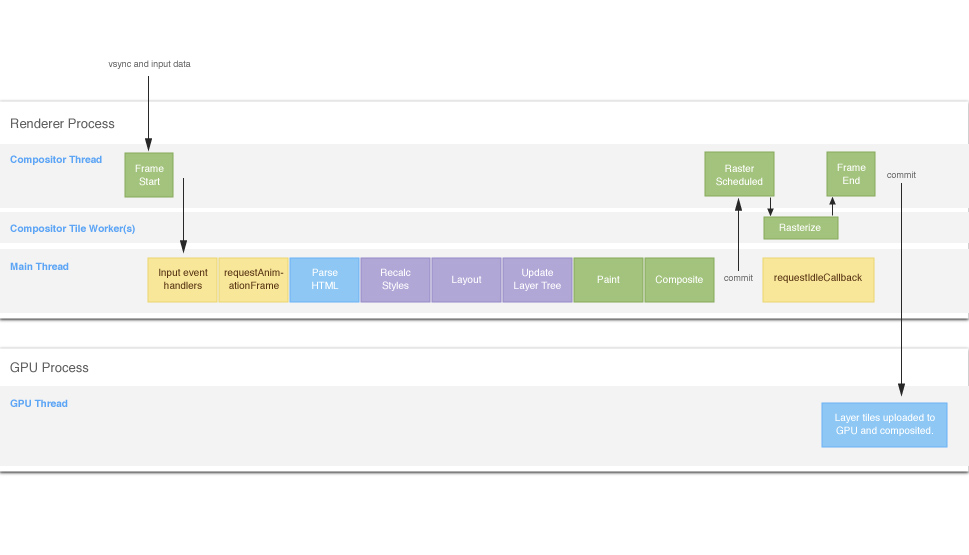
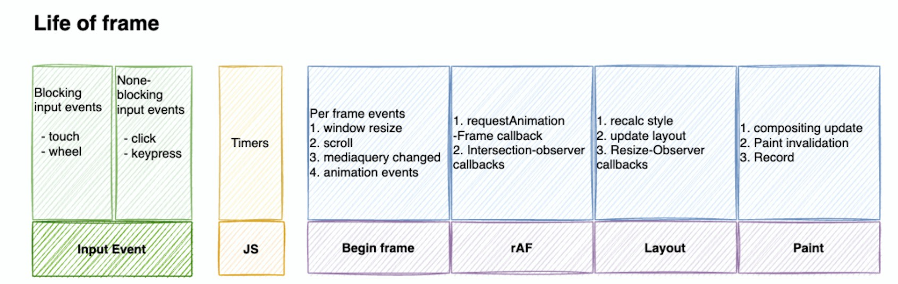

# 浏览器的渲染机制

## 浏览器包含的进程

#### 1. `Browser`进程(浏览器的主进程, 负责协调和控制浏览器, 只有一个)

1. 负责浏览器界面的显示, 与用户交互, 如前进后退
2. 负责各个页面的管理, 创建和销毁其他进程
3. 将Renderer进程得到的内存中的图片绘制到用户界面上
4. 网络资源的管理、下载等

#### 2. 浏览器渲染进程，也是浏览器内核（多线程，是多个渲染进程）

1. **合成线程（Compositor Thread）**。这是最先被告知垂直同步事件（async event，操作系统告知浏览器刷新一帧图像的信号）的线程。它接收所有的输入事件。如果可能，合成线程会避免进入主线程，自己尝试将输入的事件（比如滚动）转换为屏幕的移动。它会更新图层的位置，并经由 GPU 线程直接向 GPU 提交帧来完成这个操作。如果输入事件需要进行处理，或者有其他的显示工作，它将无法直接完成该过程，这就需要主线程了。

2. **主线程（Main Thread）**在这里浏览器执行我们熟知和喜欢的那些任务：JavaScript，样式，布局和绘制。（这一点以后会变化，有了 [Houdini](https://link.juejin.cn?target=https%3A%2F%2Fsurma.link%2Fthings%2Fhoudini-intro%2F)，我们可以在合成线程中运行一些代码）主线程荣获“最容易导致 jank 奖”，很大程度上是因为它要做的事情太多了这个事实。（译注：jank 指页面内容抖动卡顿，由于页面内容的更新频率跟不上屏幕刷新频率导致）。

   > JS引擎线程, JS内核 
   >
   > 1. 负责执行JS脚本, 如v8
   > 2. 解析JavaScript脚本, 执行代码
   > 3.  每个Tab页只有一个JS线程

   >   GUI线程
   >
   > 1. 负责渲染页面, 解析HTML、CSS构建DOM树和RenderObject结构, 布局和绘制等
   > 2. 页面需要重绘或回流时, 该线程就会执行
   > 3. GUI线程与JS引擎线程互斥

   > 事件线程
   >
   > 1. 归属于浏览器而不是JS引擎, 用来控制事件循环
   > 2. 当遇到需要异步执行的代码时, 会将相应的事件添加到事件队列中

   >  定时器线程
   >
   > 1. setTimeout 和 setInterval 所在线程
   > 2. 浏览器的定时器并不是由JS引擎计数的, 因为JS引擎是单线程, 如果处于阻塞状态会影响计时的准确性
   > 3. 计时完毕后,定时器线程会将事件添加到事件队列中,等待JS引擎空闲后执行
   > 4. W3C规范要求setTimeout的最小时间间隔为4ms

   >  HTTP请求线程 
   >
   > 1. 开启HTTP请求
   > 2. 当检测到请求状态变更时, 如果有设置回调函数,则会产生相应的事件

   

3. **合成图块栅格化线程（Compositor Tile Worker）**。由合成线程派生的一个或多个线程，用于处理栅格化任务。我们稍后再讨论。

> `service Worker`和`web Worker`进程也存在于渲染进程，先排除在外（因为他们把事情弄的很复杂）

#### 3.第三方插件进程

每个插件对应一个进程, 仅当使用该插件时才会创建

#### 4. `GPU`进程

这是一个单一的进程，在帧被提交时，GPU进程会将图块的位图和其他数据（四边形顶点）上传至GPU，真正把像素显示到屏幕上，GPU只有一个进程，叫GPU线程，用于3D图像的绘制

#### 5. 网络进程（一个）

网络资源加载

## Renderer进程（浏览器内核）和Browser进程之间的通信


`Browser`进程如同容器一样，它管理着各个`Tab`页面（主控进程），一个`Renderer`进程管理着一个`Tab`页（Tab页的渲染进程）

> ####  打开一个Tab页过程:
>
> 1. Browser收到用户的请求，首先需要获取页面内容（网络下载资源等），随后将该任务通过RendererHost接口传递给Renderer进程(详细内容见下文)
>
> 2. Renderer进程的Renderer接口收到消息，简单解释后，交给渲染线程，然后开始渲染
>
>    > 渲染线程接收请求，加载网页并渲染网页，这其中可能需要Browser进程获取资源和需要GPU进程来帮助渲染
>    >
>    > 当然可能会有JS线程操作DOM（这样可能会造成回流并重绘）
>    >
>    > 最后Render进程将结果传递给Browser进程
>
> 3. Browser进程接收到结果并将结果绘制出来

## 渲染流程（接收到Browser进程的任务，并且拿到下载的资源）


#### 1. 构建dom树

> 将HTML转化为浏览器可以理解的结构dom树
>
> （1）HTML词法、语法的解析、
> 词法分析：把字符流初步解析成我们可理解的”词”，学名叫token。
> 语法分析：把开始结束标签配对、属性赋值好、父子关系连接好、构成dom树。
> （2）请求js，css

#### 2. 样式计算（注意是计算）

> 1. 将css转化为浏览器可以理解的结构-styleSheets 
> 2. 转化样式表中的属性值，标准化
> 3. 计算具体样式（继承，样式层叠等等）

#### 3. 布局阶段

> 1. 创建布局树`layout tree`，构建一棵只包含可见元素布局树

#### 4. 分层

>  （1）图层树（LayerTree） 页面中有复杂效果，如 3D 变换、页面滚动，或者使用 z-indexing 做 z 轴排序等，渲染引擎还需要为特定的节点生成专用的图层，并生成一棵对应的图层树。 
>
>  （2）图层树和布局树的关系 布局树的每一个节点自己没有单独的图层，就属于父节点的图层，反正所有的节点都会直接或者间接地从属于一个层， 
>
>  （3）哪些节点会创建新的图层
>
> 1. 拥有 层叠上下文属性 的元素会被提升为单独的一层。 比如：明确定位属性position：fixed、定义透明属性opacity、使用 CSS 滤镜filter的元素、z-index
> 2. 需要 剪裁（clip） 的地方也会被创建为图层。 比如div内容的文字超出div范围，会被裁剪，渲染引擎单独为文字部分单独创建一个层； 如果出现滚动条，滚动条也会被提升为单独的层；

#### 5. 图层绘制

> 图层的绘制会拆分很多的小的绘制指令，然后再把这些指令按照顺序组成一个待绘制的列表

#### 6. 合成线程进行分块

> 主线程会把绘制列表提交（commit）给合成线程，进行真正的绘制
>
> 合成线程会把图层划分为图块（tile），图块的大小通常是 256x256 或者 512x512

#### 7. 栅格化

> 1. 栅格化，是指将图块转化为位图，图块是栅格化执行的最小单位。渲染进程维护了一个栅格化的线程池，所有的图块栅格化都是在线程池内执行的
> 2. 按照视口附近的图快来优先生成位图
> 3. 栅格化过程都会使用GPU来加速生成，使用GPU生层位图的过程叫做 **快速栅格化**，或者GPU栅格化，生成的位图被保存在GPU内存中，这是跨进程操作，渲染进程中的栅格化线程到GPU进程的GPU线程


#### 8. 合成和显示

> 1. 一旦所有图块都被光栅化，合成线程就会生成一个绘制图块的命令——“DrawQuad”，然后将该命令提交给浏览器进程。 
> 2. 浏览器进程里面有一个叫 viz 的组件，用来接收合成线程发过来的 DrawQuad 命令，然后根据 DrawQuad 命令，将其页面内容绘制到内存中，最后再将内存显示在屏幕上。
> 3. 之前说到的图块存于GPU内存中，GPU将图块draw到屏幕上


## 总结渲染过程

1. 转化DOM树（dom） 2. 样式表计算（style） 3. 创建布局树（layout）4. 分图层（layer） 5. 图层绘制（paint） 6. 分图块（titles） 7. 栅格化（raster）8. GPU提交帧（draw quad）9. 显示（display）

#### 重排：修改几何属性，影响layout后面全部

#### 重绘：修改绘制属性，影响paint后面所有

#### 合成：

修改不要布局不要绘制的属性，只影响后续的合成操作tiles后面，性能会提升  

常见的就是css3硬件加速（GPU加速），`transform: translateZ(0)、opacity、filters、will-change， will-change`提前告诉浏览器元素会发生什么变化；

> 硬件加速减少CPU的操作，利用GPU进行渲染的一种优化方案。主要是因为css的上面提及到的一些属性，不会触发repaint。（已验证）

**需要重点说的是：**在GPU渲染过程中，一些元素符合了某些规则，而别提升到了独立的层（不同的图层），一旦独立出来，就不会影响其他dom的布局，所以可以利用这些规则，将经常变化的dom主动提升到独立的层，在浏览器一帧layout和paint的时间了

如果有一些元素不需要用到上述属性，但是需要触发硬件加速效果，可以使用一些小技巧来诱导浏览器开启硬件加速。

<details>
  <summary>诱导开启硬件加速</summary>
.element {
    -webkit-transform: translateZ(0);
    -moz-transform: translateZ(0);
    -ms-transform: translateZ(0);
    -o-transform: translateZ(0);
    transform: translateZ(0); 
    /**或者**/
    transform: rotateZ(360deg);
    transform: translate3d(0, 0, 0);
}
</details>

<details>
  <summary>可以让浏览器创建单独的层</summary>
1. 3D 或者透视变换（perspective，transform） 的 CSS 属性。<br/>
2. 使用加速视频解码的 video 元素。<br/>
3. 拥有 3D（WebGL） 上下文或者加速 2D 上下文的 canvas 元素。<br/>
4. 混合插件（Flash)。<br/>
5. 对自己的 opacity 做 CSS 动画或使用一个动画 webkit 变换的元素。<br/>
6. 拥有加速 CSS 过滤器的元素。<br/>
7. 元素有一个包含复合层的后代节点(换句话说，就是一个元素拥有一个子元素，该子元素在自己的层里)。<br/>
8. 元素有一个兄弟元素在复合图层渲染，并且该兄弟元素的 z-index 较小，那这个元素也会被应用到复合图层。</details>


## 浏览器的一帧动作

<a href="https://github.com/xitu/gold-miner/blob/master/TODO1/the-anatomy-of-a-frame.md">一帧动作（国外文献）</a>



#### 1.渲染进程的合成线程（Compositor Thread）  ，从垂直信号入手

（1）在显卡中有一块叫着前缓冲区的地方，存放着显示器要显示的图像，显示器会按照一定的频率来读取这块前缓冲区，并将前缓冲区中的图像显示在显示器上，不同的显示器读取的频率是不同的，通常情况下是 60HZ ，也就是说显示器会每间隔 1/60 秒就读取一次前缓冲区。 （2）当显示器将一帧画面绘制完成后，并在准备读取下一帧之前，显示器会发出一个垂直同步信号（vertical synchronization），简称 VSync 。 （3）操作系统告知浏览器刷新一帧图像的信号，合成进程是最先被告知垂直同步事件vsync event。

####  2.处理事件输入 

从合成线程将输入的数据，传递到主线程的事件处理函数。

####  3.RAF~requestAnimation  

调用 RAF在每一帧的开始，确切的说是raf的回调任务会在每一帧的开始执行；

####  4.上面的渲染过程

 DOM、sytle、layout、layers、paint、tiles、raster、draw quad、display 

#### 5.帧结束还有时间调用requestIdleCallback

 理想的一帧时间是 16ms (1000ms / 60)，如果浏览器处理完上述的任务(布局和绘制之后)，还有盈余时间，浏览器就会调用 requestIdleCallback 的回调

> 注意的是浏览器**并不需要执行所有步骤**，具体情况取决于哪些步骤是必需的。例如，如果没有新的 HTML 要解析，那么解析 HTML 的步骤就不会触发。通常[提升性能的最佳方法](https://link.juejin.cn/?target=https%3A%2F%2Fdevelopers.google.com%2Fweb%2Ffundamentals%2Fperformance%2Frendering%2F%23the-pixel-pipeline)，只是简单地移除流程中部分步骤被触发的需要！

## 重新理解浏览器的一帧



1. 从requestAnimationFarme中，重新理解一下浏览器的一帧，自我理解是浏览器的一帧是从raf的回调执行到绘制完成，也就是（begin frame~~paint），而**`一些输入事件，JS代码执行是夹在两帧中的动作`**。

2. ```js
     let height = ''
     Promise.resolve().then(() => height = 1.99)
      	requestAnimationFrame((time) => {
               console.log(height)
               console.log("raf:", time)
   })
   ```

   >  微任务可以拿到height的值，宏任务中拿不到height的值，所以说raf在js执行之后
     >
     > MessageChannel执行在宏任务的首位，早于setTimeout
   
     准确的说是raf的回调函数会在每一帧的开始执行，并且拿到帧的开始时间。


