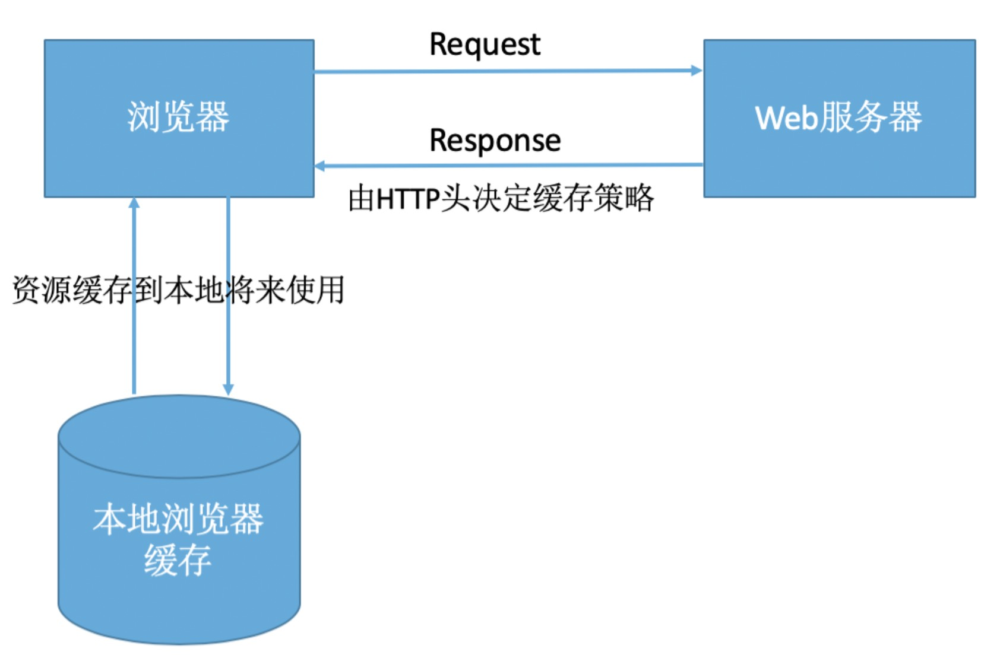
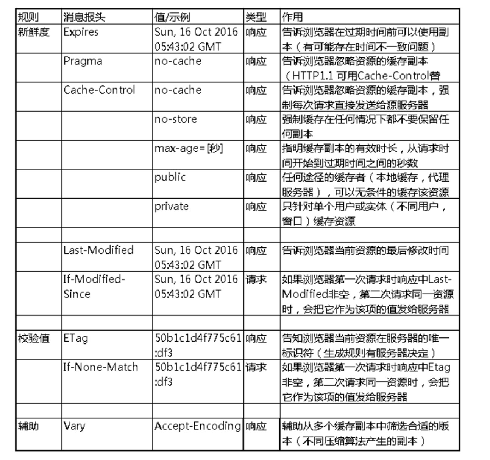

#                         浏览器缓存机制

## 首先要说的是，浏览器缓存是建立在第一次访问目的资源

# HTTP缓存策略分两种：

#### 在这之前需要知道的请求头：

1. ## 强缓存（本地缓存，不走请求）：

   浏览器发送请求前，会先去缓存里查看是否命中强缓存，如果命中，则直接从缓存中读取资源，不会发送请求到服务器。否则，进入下一步。

   ##### 关键的属性：

   1. max-age：代表已接收到 cookie 之后的 XX 秒之后过期

   2. expired：代表什么时候过期，存在时间不一致问题

      

2. ## 协商缓存（弱缓存，浏览器和服务器协商）：

   强缓存没有命中，向服务器发送请求，根据字段的情况，进入下一步

   ##### 关键的属性：

​		1.  last-modified :

​		服务器返回资源的同时，在响应头中添加 last-modified 的 header，浏览器接收后缓存文件和header，浏		览器下一次请求这个资源，浏览器检测到有 last-modified 这个 header，last-modified 和服务器中这个资		源的最后修改时间对比，如果没有变化，返回 304 和空的响应体，直接走缓存。		

​		**存在缺点**：在服务器打开这个文件，没有修改 wq 推出，但是这个 last-modified 会改变，服务器会错误判		断，浏览器就不走缓存了

​		2. etag :

​		将整个文件哈希,将前后两段文件哈希比较，更精确，但是很消耗性能。

##### 	 etag的优点：

##### 		a. Last-Modified 标注的最后修改只能精确到秒级，如果某些文件在 1 秒钟以内，被修改多次的话，它将不能准确标注文件的新鲜度；

##### 		b. 某些文件也许会周期性的更改，但是他的内容并不改变(仅仅改变的修改时间)，但 Last-Modified 却改变了，导致文件没法使用缓存；

##### 		c. 有可能存在服务器没有准确获取文件修改时间，或者与代理服务器时间不一致等情形。

- ##### 优先级：ETag 优先级比 Last-Modified 高，同时存在时会以 ETag 为准。

  

## 个人理解：

第一次请求资源的时候，会在响应头中获取缓存策略的字段头，由http响应决定以后缓存策略。

请求都会先走强缓存，`if`命中缓存，直接返回资源（用的就是max-age的这个字段，判断是否是否过期，不过期直接使用），如果强缓存没有命中的话，在走协商缓存，发出网络请求，服务器判断请求头中的`last-modified` 字段，last-modified 和服务器中这个资源的最后修改时间对比，如果没有变化，返回 304 和空的响应体，只是告诉浏览器可以直接从浏览器缓存中获取这个资源。如果本地缓存和协商缓存都没有命中，则从直接从服务器加载资源。

# 位置缓存分四种：

> 优先级（Service Worker -> Memory Cache（内存中的缓存） -> Disk Cache（硬盘中的缓存） -> Push Cache）依次查找缓存（（推送缓存）是 HTTP/2 中的内容）

### Service Worker（简单理解，不再做过多扩展）：

`（请见 Worker.md）`

